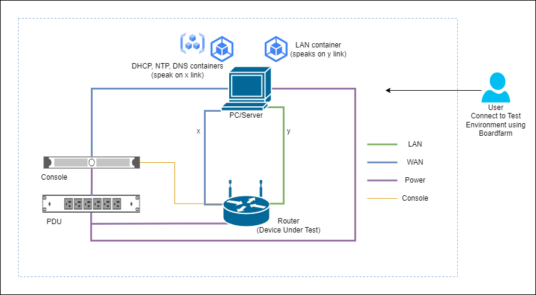

# Boardfarm
<p align=center>
     <br>
    
    
    
    
    <a href="https://github.com/psf/black"></a>
    <a href="https://github.com/astral-sh/ruff"></a>
</p> <hr>

Boardfarm is an open-source IT automation framework purely written in Python (3.9+).

Its primary focus revolves around systems configuration, infrastructure deployment,
and orchestration of advanced IT tasks such as Subscriber Provisioning,
Line Termination System bootups (LTS) or a CPE firmware flash via bootloader.

It empowers its users with the ability to automate and comprehensively
test their devices across a wide range of target environments.

## Motivation

Boardfarm was initially developed at Qualcomm to automate testing of OpenWrt
routers and other embedded devices.



Over time, the framework evolved to support RDK-B derived boards and IoT devices,
along with the essential OSS and back-office components necessary for simulating
a Telecom Service Providers' environment.


The operation of a device or the configuration of a server can vary depending
on the specific hardware variant or the infrastructure layout of the deploying
Telecom Operator.

To address this variability, Boardfarm utilizes Pluggy to introduce a hook
structure that enables its users to register customized code through plugins
for each individual infrastructure component.

This structure also enforces a uniform API specification, allowing plugins to
invoke their implementation at any of the predefined checkpoints within the
Boardfarm's execution cycle, offering flexibility and extensibility.

## Features
- Modular Hook definitions enabling users to independently
initiate the bootup/deployment process for each component within the infrastructure,
offering granular control and flexibility.
- Seamless integration with Pytest. Provides easy access to devices along with their
pre-set operations through protocol-specific libraries.
- A versatile connection manager that abstracts physical device connections,
offering a unified set of APIs for RS232, SSH, Telnet, SNMP, and HTTP(s)
communication with the infrastructure.
- A library of device templates (Python ABCs) that can be inherited and customized
for implementing hardware interactions without application or server specific constraints.
- A plugin architecture that enables vendors and OEMs to perform testing and provisioning
on their firmware builds/devices, whether in a predefined production or fully
simulated test environment.
- Integration with Docker/QEMU to simulate various test environments and devices.

## Installation
Run the following command to directly install the package from the repo:

```bash
pip install git+https://github.com/lgirdk/boardfarm.git@boardfarm3
```

## Usage
```bash
boardfarm -h
```
This will display help for the framework. Here are all the switches it supports.
```
usage: boardfarm [-h] --board-name BOARD_NAME --env-config ENV_CONFIG --inventory-config INVENTORY_CONFIG [--legacy] [--skip-boot] [--skip-contingency-checks] [--save-console-logs]

options:
  -h, --help            show this help message and exit
  --board-name BOARD_NAME
                        Board name
  --env-config ENV_CONFIG
                        Environment JSON config file path
  --inventory-config INVENTORY_CONFIG
                        Inventory JSON config file path
  --legacy              allows for devices.<device> obj to be exposed (only for legacy use)
  --skip-boot           Skips the booting process, all devices will be used as they are
  --skip-contingency-checks
                        Skip contingency checks while running tests
  --save-console-logs   Save console logs to the disk
```

## Documentation
For full documentation, including installation, tutorials and architecture overview,
please see <br>
[Boardfarm Documentation](/boardfarm3/docs/documentation.md)

## Changelog
Consult the [CHANGELOG](/CHANGELOG.md) page for fixes and enhancements of each version.

## License
Distributed under the terms of the Clear BSD License, Boardfarm is free and
open source software.
